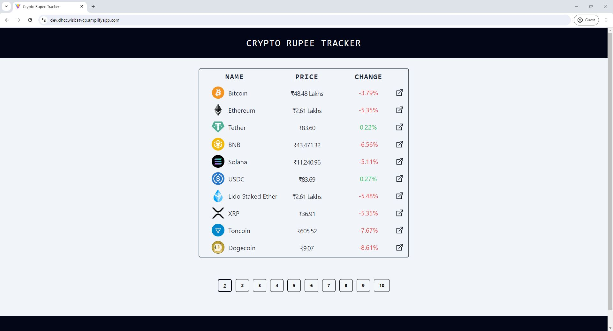
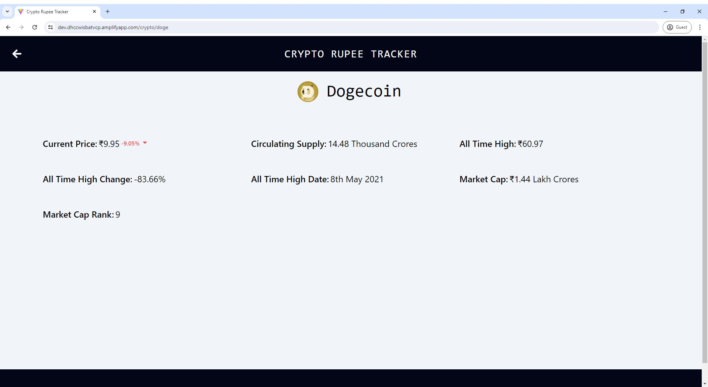

# Crypto Rupee Tracker

A fully responsive full-stack web app developed using TypeScript-based AWS Lambda Function, TypeScript-based React.JS, and Tailwind CSS. It displays the prices of the top 100 cryptocurrencies in Indian Rupees (INR/₹) and is deployed using AWS Amplify.

It also displays other details regarding a cryptocurrency like circulating supply, all-time high, all-time high change, all-time high date, market cap, and market cap rank.

[Live Demo](https://dev.dhccwisbatvcp.amplifyapp.com)

## Main page of website

## Crypto Details page

